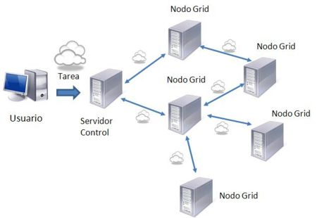

# 1.1. Procesos, Programas, hilos

- [1.1.1. Procesos y programas](#111-procesos-y-programas)
- [1.1.2. Programación concurrente](#112-programación-concurrente)
  - [¿Para qué?](#para-qué)
  - [Comunicación y sincronización entre procesos](#comunicación-y-sincronización-entre-procesos)
- [1.1.3. Servicios e hilos](#113-servicios-e-hilos)
  - [Programa secuencial (Arquitectura Von Neumann)](#programa-secuencial-arquitectura-von-neumann)
  - [Programa concurrente](#programa-concurrente)
  - [Hilos vs procesos](#hilos-vs-procesos)
  - [Servicios](#servicios)

---

## 1.1.1. Procesos y programas

Un `programa` no es más que un conjunto de instrucciones u órdenes que le indican a un dispositivo qué acciones debe realizar con los datos recibidos.

**Caja negra**
Según la visión de un sistema como caja negra, un programa le indica al sistema cómo obtener unos datos de salida a partir de unos datos de entrada.

Un `proceso` es un programa en ejecución.
- Proceso = entidad activa
- Programa = entidad pasiva

El proceso está representado por:
- Contador del programa
- Registros
- Pila
- Código ejecutable
- Estado


Cada proceso es independiente. Ejecutar varias veces un mismo programa crea varios procesos distintos.

---

## 1.1.2. Programación concurrente

#### Multiproceso

El multiproceso consiste en la ejecución de varios procesos diferentes de forma  _simultánea_  para la realización de una o varias tareas relacionadas o no entre sí. En este caso, cada uno de estos procesos es una aplicación independiente. El caso más conocido es aquel en el que nos referimos al Sistema Operativo (Windows, Linux, MacOS, . . .) y decimos que es  _multitarea_  puesto que es capaz de ejecutar varias tareas o procesos (o programas) al mismo tiempo.

#### Multihilo

Hablamos de multihilo cuando se ejecutan varias tareas relacionadas o no entre sí dentro de una misma aplicación. En este caso no son procesos diferentes sino que dichas tareas se ejecutan dentro del mismo proceso del Sistema Operativo. A cada una de estas tareas se le conoce como hilo o thread (en algunos contextos también como procesos ligeros).

En ambos casos estaríamos hablando de lo que se conoce como  **Programación Concurrente**. Hay que tener en cuenta que en ninguno de los dos casos la ejecución es realmente simultánea, ya que el Sistema Operativo es quién hace que parezca así, pero los ejecuta siguiendo lo que se conoce como  _algoritmos de planificación_.

#### Programación concurrente, paralela y distribuida
##### Programación concurrente
Es la programación de aplicaciones capaces de realizar varias tareas de forma simultánea utilizando hilos o threads. En este caso todas las tareas compiten por el uso del procesador (lo más habitual es disponer sólo de uno) y en un instante determinado sólo una de ellas se encuentra en ejecución. Además, habrá que tener en cuenta que diferentes hilos pueden compartir información entre sí y eso complica mucho su programación y coordinación.

##### Programación paralela
Es la programación de aplicaciones que ejecutan tareas de forma paralela, de forma que no compiten por el procesador puesto que cada una de ellas se ejecuta en uno diferente. Normalmente buscan resultados comunes dividiendo el problema en varias tareas que se ejecutan al mismo tiempo.

##### Programación distribuida
Es la programación de aplicaciones en las que las tareas a ejecutar se reparten entre varios equipos diferentes (conectados en red, a los que llamaremos nodos). Juntos, estos equipos, forman lo que se conoce como un Sistema Distribuido, que busca formar redes de equipos que trabajen con un fin común


Concurrencia vs Paralelismo


Programación distribuida

### ¿Para qué?

Razones principales para la concurrencia:

- Optimizar uso de recursos (CPU menos ociosa).
- Interactividad y animación gráfica.
- Mejorar la disponibilidad (servidores concurrentes).
- Modularidad y claridad en el diseño.
- Aumento de la protección (tareas aisladas).

**Nuevos entornos hardware:**
- Multinúcleo con memoria compartida
- Multiprocesador
- Distribuidos y *cloud*

### Comunicación y sincronización entre procesos

Cuando varios procesos se ejecutan concurrentemente:
- **Colaboran** para un fin
- **Compiten** por recursos

Formas de comunicación:
- Intercambio de mensajes
- Recursos o memoria compartida

Según la sincronía:
- **Síncrona**: el emisor espera al receptor
- **Asíncrona**: el emisor no espera

---

## 1.1.3. Servicios e hilos

Un programa se compone de sentencias y un flujo de ejecución.

Tipos de procesos:
- **Secuenciales**: monohilo
- **Concurrentes**: multihilo

### Programa secuencial (Arquitectura Von Neumann)

- Flujo lineal de control
- Orden estrictamente temporal
- Verificación sencilla (caja blanca)


### Programa concurrente

- Varios flujos de control
- Orden parcial (no estrictamente secuencial)
- Necesidad de sincronización
- Indeterminismo posible


Ejemplo de pseudocódigo:

```java
public class TestClass {
    int x;

    public void testMethod1() {
        for (int i=1; i <= 5; i++) {
            x++;
        }
    }
    public void testMethod2() {
        for (int j=1; j <= 5; j++) {
            x++;
        }
    }
    public void sequential() {
        x = 0;
        testMethod1();
        testMethod2();
        System.out.println(x);
    }
    public void parallel() {
        x = 0;
        cobegin
            testMethod1();
            testMethod2();
        coend
        System.out.println(x);
    }
}
```

**Reseña histórica**
Dijkstra (1968), Brinch Hansen (1973), Hoare (1974).
Fundamentos de sistemas multiproceso (años 70–80).

### Hilos vs procesos

| Procesos | Hilos |
|----------|-------|
| Constan de uno o más hilos | Un hilo siempre existe dentro de un proceso |
| Son independientes unos de otros | Comparten los recursos del proceso |
| Gestionados por el SO | Gestionados por el proceso |
| Se comunican a través del SO | Comunicación controlada por el proceso |


### Servicios

Un servicio es un proceso cargado al arranque del sistema operativo.
- No requiere interacción con usuario
- Se ejecuta en segundo plano (*daemon*)
- Atiende peticiones de otros procesos
- Suelen ser programas multihilo
