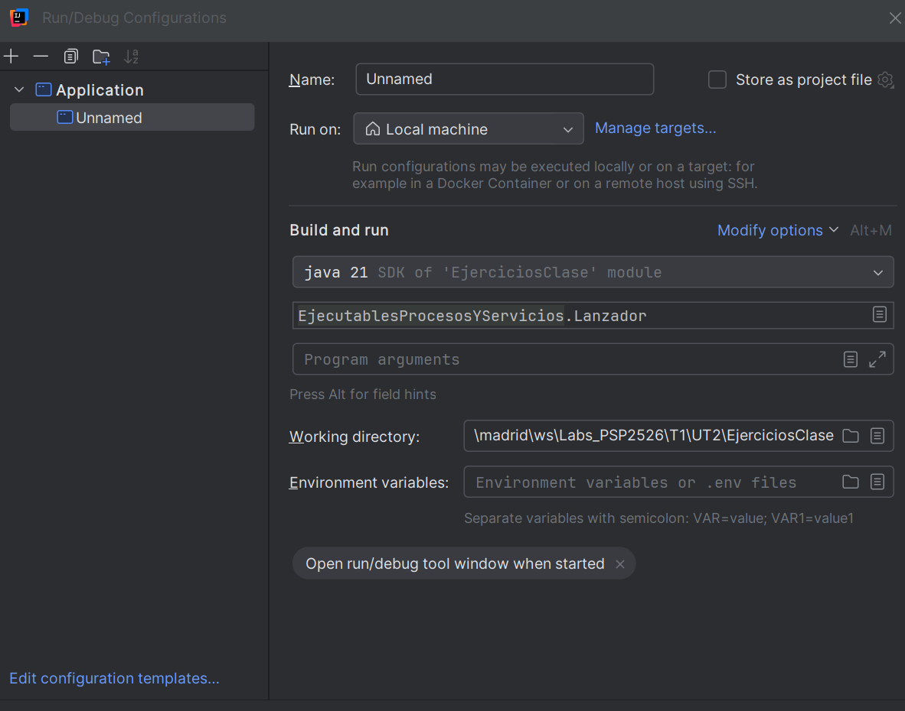

## 2.2. Gestión de procesos en Java - ProcessBuilder y Process

### Índice de contenidos

- 2.2.1. Preparación y configuración de un proceso
  - Modificar el comando en tiempo de ejecución
  - Configuraciones adicionales de un proceso
- 2.2.2. Acceso al proceso una vez en ejecución
- 2.2.3. Lanzar una clase Java como proceso desde otra clase java en el mismo proyecto
- 2.2.4. Información de los procesos en Java
  - Obtener información desde el propio proceso
  - Obtener información de un proceso lanzado

### 2.2.1. Preparación y configuración de un proceso

En el paquete `java.lang` tenemos dos clases para la gestión de procesos:

- `java.lang.ProcessBuilder` [Referencia API Java](https://docs.oracle.com/javase/8/docs/api/java/lang/ProcessBuilder.html)
- `java.lang.Process` [Referencia API Java](https://docs.oracle.com/javase/8/docs/api/java/lang/Process.html)

Las instancias de `ProcessBuilder` gestionan los atributos de los procesos, mientras que las instancias de `Process` controlan la ejecución de esos mismos procesos cuando se ejecutan.

Antes de ejecutar un nuevo proceso, podemos configurar los parámetros de ejecución del mismo usando la clase `ProcessBuilder`.

`ProcessBuilder` es una clase auxiliar de la clase `Process`, que veremos más adelante, y se utiliza para controlar algunos parámetros de ejecución que afectarán al proceso. A través de la llamada al método `start` se crea un nuevo proceso en el sistema con los atributos definidos en la instancia de `ProcessBuilder`.

```java
ProcessBuilder pb = new ProcessBuilder("CMD", "/C", "DIR");
Process p = pb.start();
```

Si llamamos varias veces al método `start`, se crearán tantos nuevos procesos como llamadas hagamos, todos ellos con los mismos atributos.

La clase `ProcessBuilder` define un par de constructores:

```java
ProcessBuilder(List<String> command)
ProcessBuilder(String... command)
```

El funcionamiento de ambos es el mismo. En el primer constructor se pasa el comando a ejecutar y la lista de argumentos como una lista de cadenas. Por contra, en el segundo constructor, el comando y sus argumentos se pasan a través de un número variable de cadenas (`String ...` es lo que en Java se llama varargs). La versión que utilicemos depende del formato en que tengamos los datos.

#### Argumentos y parámetros

Si queremos lanzar un programa con parámetros (modificadores que hacen que cambie la forma de funcionar un programa como `-h`, `/s` ...) el comando no puede ser pasado al constructor directamente como un único string, debe ser preprocesado para convertirlo en una lista y que funcione.

```java
// Formas diferentes de pasar el comando a los constructores de ProcessBuilder
// 1ª forma: usando una cadena. Falla con parámetros
// Sólo funciona con programas que tengan argumentos
String command1 = "notepad.exe prueba1.txt"
ProcessBuilder pb = new ProcessBuilder(command1);

// 2ª forma: usando un array de cadenas. Funciona con parámetros
String[] command2 = {"cmd", "/c", "dir", "/o"};
ProcessBuilder pb = new ProcessBuilder(command2);

// 3ª forma: usando una cadena y dividiéndola para convertirla en una lista
String command3 =  "c:/windows/system32/shutdown -s -t 0";
// La expresión regular \s significa partir por los espacios en blanco
ProcessBuilder pb = new ProcessBuilder(command3.split("\\s"));
// ESTA ES LA MEJOR FORMA PARA QUE FUNCIONE EN TODOS LOS CASOS
```

> **Apagar el sistema operativo**
>
> El comando `shutdown -s` sirve para apagar el sistema. En windows es necesario proporcionar la ruta completa al comando, por ejemplo `C:\Windows\System32\shutdown`.
>
> Podemos usar como parámetro `-s` para apagar el sistema, `-r` para reiniciar, `-h` para hibernar y `-t` para indicar un tiempo de espera antes de apagar.
>
> [Referencia del comando shutdown de Windows](https://docs.microsoft.com/en-us/windows-server/administration/windows-commands/shutdown)

<details>
<summary><strong>Activity psp.activities.U2A1_Shutdowner</strong></summary>

Crea una nuevo proyecto Java (package `psp.actividades` y como clase principal `U2A1_Shutdowner`). Usando la línea de comandos, pide al usuario qué acción quiere realizar (apagar, reiniciar o suspender) y cuánto tiempo quiere dejar antes de realizar la acción de apagado del sistema.

Busca información sobre el funcionamiento del comando `shutdown` en GNU/Linux y haz que tu aplicación funcione para ambos sistemas.

La aplicación tiene que preparar el comando correcto para la selección que haya hecho el usuario y para el sistema operativo en el que la esté ejecutando.

Muestra por consola el resultado del método `ProcessBuilder.command()` de forma legible.

<details>
<summary><strong>Solución de U2A1_Shutdowner</strong></summary>

```java
public class U2A1_Shutdowner {

        public static void main(String[] args) throws IOException {
                // Ask for the required information to prepare the command
                Scanner keyboard = new Scanner(System.in);

                System.out.print("Select your option (s-shutdown / r-reboot / h-hibernate): ");
                String shutdownOption = keyboard.nextLine();

                System.out.print("How much seconds will the command wait to be run? (0 means immediately): ");
                String shutdownTime = keyboard.nextLine();

                // Prepare the command
                String command;
                if (System.getProperty("os.name").toLowerCase().startsWith("windows")) {
                        command = "C:/Windows/System32/shutdown -" + shutdownOption + " -t " + shutdownTime;
                } else {
                        command = "shutdown -" + shutdownOption + " -t " + shutdownTime;
                }

                // Prepare the process and launch it
                ProcessBuilder shutdowner = new ProcessBuilder(command.split("\\s"));
                //shutdowner.start();

                // Show the command to be run
                System.out.print("El comando a ejecutar es:  ");
                for (String commandPart: shutdowner.command()) {
                        System.out.print(commandPart + " ");
                }
                System.out.println("");
        }
}
```

</details>

</details>

#### Modificar el comando en tiempo de ejecución

Puede ser que todo el comando, o parte del mismo, no lo tengamos en el momento de llamar a los constructores de `ProcessBuilder`. Se puede cambiar, modificar y consultar a posteriori con el método `command`.

Al igual que con los constructores, tenemos dos versiones del método `command`:

```java
command(List<String> command)
command(String... command)
```

y la tercera forma de este método (sin parámetros) sirve para obtener una lista del comando pasado al constructor o puesto con alguna de las formas anterior del método `command`. Lo interesante es que una vez que tenemos la lista, podemos modificarla usando los métodos de la clase `List`.

En el siguiente ejemplo, en el momento de definir el comando, nos falta saber la última parte, el directorio temporal. Además, si queremos hacer que la ejecución sea multiplataforma, el shell a ejecutar tampoco lo sabemos. Dependiendo del SO se añaden dos valores al principio y un valor al final, con el método `add` de la clase `List`.

```java
// Sets and modifies the command after ProcessBuilder object is created
String command = "java -jar install.jar -install"; // tmp dir is missing
ProcessBuilder pbuilder = new ProcessBuilder(command.split("\\s"));
if (isWindows) {
        pbuilder.command().add(0, "cmd"); // Sets the 1st element
        pbuilder.command().add(1, "/c"); // Sets the 2nd element
        pbuilder.command().add("c:/temp"); // Sets the last element
        // Command to run cmd /c java -jar install.jar -install c:/temp
} else {
        pbuilder.command().add(0, "sh"); // Sets the 1st element
        pbuilder.command().add(1, "-c"); // Sets the 2nd element
        pbuilder.command().add("/tmp"); // Sets the last element
        // Command to run: sh -c java -jar install.jar -install /tmp
}

// Starts the process
pbuilder.start();
```

#### Configuraciones adicionales de un proceso

Algunos de los atributos que podemos configurar para un proceso son:

**Establecer el directorio de trabajo donde el proceso se ejecutará**

Podemos cambiar el directorio de trabajo por defecto llamando al método `directory` y pasándole un objeto de tipo `File`. Por defecto, el directorio de trabajo se establece al valor de la variable del sistema `user.dir`. Este directorio es el punto de partida para acceder a ficheros, imágenes y todos los recursos que necesite nuestra aplicación.

```java
// Cambia el directorio de trabajo a la carpeta personal del usuario
pbuilder.directory(new File(System.getProperty("user.home")));
```

**Configurar o modificar variables de entorno para el proceso con el método `environment()`**

```java
// Retrieve and modify the process environment
Map<String, String> environment = pbuilder.environment();
// Get the PATH environment variable and add a new directory
String systemPath = environment.get("path") + ";c:/users/public";
environment.replace("path", systemPath);
// Add a new environment variable and use it as a part of the command
environment.put("GREETING", "Hola Mundo");
processBuilder.command("/bin/bash", "-c", "echo $GREETING");

// Indicamos el directorio donde se encuentra el ejecutable
File directorio = new File ("bin");
pb.directory(directorio);

// Mostramos la información de las variables de entorno
Map variablesEntorno = pb.environment();
System.out.println(variablesEntorno);

// Mostramos el nombre del proceso y sus argumentos
List command = pb.command();
Iterator iter = l.iterator();
while (iter.hasNext()) {
        System.out.println(iter.next());
}
```

> **Variables de entorno vs Propiedades del sistema**
>
> Con la clase `Runtime` accedemos a las variables del sistema mientras que con `ProcessBuilder` lo hacemos a las propiedades del sistema, que son diferentes.

**Redireccionar la entrada y salida estándar**

Heredar la E/S estándar del proceso padre usando el método `ProcessBuilder.inheritIO()`

Estas dos configuraciones se verán en el siguiente apartado.

<details>
<summary><strong>Actividad psp.activities.U2A2_DirectorioTrabajo</strong></summary>

Crea un nuevo proyecto Java (Ant > Java Application) (configura como nombre del proyecto `U2A2_DirectorioTrabajo` y como clase principal `psp.activities.U2A2_WorkingDirectory`) Escribe un programa que ejecute el comando `ls` o `dir`. Modifica el valor de la propiedad `user.dir`. En la misma aplicación, cambiar el directorio de trabajo a la carpeta `c:/temp` o `/tmp`, dependiendo del sistema operativo.

Muestra el valor devuelto por el método `directory()`:

- Después de crear la instancia de `ProcessBuilder`
- Después de cambiar el valor de `user.dir`
- Después de cambiar el directorio de trabajo al directorio temporal del sistema.

En este momento tu programa todavía no mostrará ningún listado.

<details>
<summary><strong>Solución de U2A2_DirectorioTrabajo</strong></summary>

```java
// Solución disponible al instructor
```

</details>

</details>

### 2.2.2. Acceso al proceso una vez en ejecución

La clase `Process` es una clase abstracta definida en el paquete `java.lang` y contiene la información del proceso en ejecución. Tras invocar al método `start` de `ProcessBuilder`, éste devuelve una referencia al proceso en forma de objeto `Process`.

Los métodos de la clase `Process` pueden ser usados para realizar operaciones de E/S desde el proceso, para comprobar su estado, su valor de retorno, para esperar a que termine de ejecutarse y para forzar la terminación del proceso. Sin embargo estos métodos no funcionan sobre procesos especiales del SO como pueden ser servicios, shell scripts, demonios, etc.

[Especificación java.lang.Process](https://docs.oracle.com/javase/8/docs/api/java/lang/Process.html)

#### Entrada / Salida desde el proceso hijo

Curiosamente los procesos lanzados con el método `start()` no tienen una consola asignada. Por contra, estos procesos redireccionan los streams de E/S estándar (stdin, stdout, stderr) al proceso padre. Si se necesita, se puede acceder a ellos a través de los streams obtenidos con los métodos definidos en la clase `Process` como `getInputStream()`, `getOutputStream()` y `getErrorSteam()`. Esta es la forma de enviar y recibir información desde los subprocesos.

Los principales métodos de esta clase son:

| Método                                         | Descripción                                                                                                                                                                                                                                                                                                          |
| ---------------------------------------------- | -------------------------------------------------------------------------------------------------------------------------------------------------------------------------------------------------------------------------------------------------------------------------------------------------------------------- |
| `int exitValue()`                              | Código de finalización devuelto por el proceso hijo (ver Info más abajo)                                                                                                                                                                                                                                             |
| `Boolean isAlive()`                            | Comprueba si el proceso todavía está en ejecución                                                                                                                                                                                                                                                                    |
| `int waitFor()`                                | hace que el proceso padre se quede esperando a que el proceso hijo termine. El entero que devuelve es el código de finalización del proceso hijo                                                                                                                                                                     |
| `Boolean waitFor(long timeOut, TimeUnit unit)` | El funcionamiento es el mismo que en el caso anterior sólo que en esta ocasión podemos especificar cuánto tiempo queremos esperar a que el proceso hijo termine. El método devuelve `true` si el proceso termina antes de que pase el tiempo indicado y `false` si ha pasado el tiempo y el proceso no ha terminado. |
| `void destroy()`                               | Estos dos métodos se utilizan para matar al proceso. El segundo lo hace de forma forzosa.                                                                                                                                                                                                                            |
| `Process destroyForcibly()`                    |                                                                                                                                                                                                                                                                                                                      |

Veamos un sencillo ejemplo. Una vez lanzado el programa espera durante 10 segundos y a continuación mata el proceso.

```java
public class ProcessDemo {

     public static void main(String[] args) throws Exception {

            ProcessBuilder pb = new ProcessBuilder("C:/Program Files (x86)/Notepad++/notepad++.exe");
            // Effectively launch the process
            Process p = pb.start();
            // Check is process is alive or not
            boolean alive = p.isAlive();
            // Wait for the process to end for 10 seconds.
            if (p.waitFor(10, TimeUnit.SECONDS)) {
                    System.out.println("Process has finished");
            } else {
                    System.out.println("Timeout. Process hasn't finished");
            }
            // Force process termination.
            p.destroy();
            // Check again if process remains alive
            alive = p.isAlive();
            // Get the process exit value
            int status = p.exitValue();
     }
}
```

> **Códigos de terminación**
>
> Un código de salida (exit code o a veces también return code) es el valor que un proceso le devuelve a su proceso padre para indicarle cómo ha acabado. Si un proceso acaba con un valor de finalización 0 es que todo ha ido bien, cualquier otro valor entre 1 to 255 indica alguna causa de error.

<details>
<summary><strong>Actividad psp.activities.U2A3_ExitValue</strong></summary>

Crea un nuevo proyecto Java (Ant > Java Application) (configura como nombre del proyecto `U2A3_ExitValue` y como clase principal `psp.activities.U2A3_ExitValue`). Prepara un programa que ejecute varios comandos (notepad, calc, comandos shell) uno detrás de otro, de forma secuencial y haz que tu programa obtenga el código de finalización de cada uno de ellos. Para cada programa imprime el nombre y su código de finalización.

Prueba a poner aplicaciones que no existan o comandos con parámetros incorrectos.

¿Qué hace Netbeans si pones `System.exit(10)` para acabar tu programa?. Fíjate en la consola. ¿Qué hace Netbeans si pones `System.exit(0)` para acabar tu programa.? Cuál es entonces el valor por defecto?

<details>
<summary><strong>Solución de U2A3_ExitValue</strong></summary>

```java
public class U2A3_ExitValue {

        public static void main(String[] args) {
                do {
                        // Código para pedir un programa/comando a ejecutar
                        Scanner teclado = new Scanner(System.in);
                        System.out.println("Introduce el programa / comando que quieres ejecutar (intro para acabar): ");
                        String comando = teclado.nextLine();

                        if (comando.equals("")) System.exit(0);

                        try {
                                // Preparamos el entrono de ejecución del proceso
                                // Como no sabemos el contenido del comando, forzamos su conversión
                                // a una lista para que no haya problemas con su ejecución
                                ProcessBuilder pb = new ProcessBuilder(comando.split("\\s"));

                                // Lanzamos el proceso hijo
                                Process p = pb.start();

                                // Esperamos a que acabe para recoger el valor de salida
                                int exitValue = p.waitFor();

                                if (exitValue == 0) {
                                        System.out.println("El comando " + pb.command().toString() + " ha finalizado bien");
                                } else {
                                        System.out.println("El comando " + pb.command().toString() + " ha finalizado con errores. Código (" + exitValue + ")");
                                }

                        } catch (InterruptedException | IOException ex) {
                                System.err.println(ex.getLocalizedMessage());
                                ex.printStackTrace();
                        }
                } while (true);
        }
}
```

</details>

</details>

> **Gestión de excepciones**
>
> La llamada al método `waitFor` hace que el proceso padre se bloquee hasta que el proceso hijo termina o bien hasta que el bloqueo es interrumpido por alguna señal del sistema (Excepción) que recibe el proceso padre.
>
> Es mejor gestionar las excepciones lo más cerca posible del origen en vez de pasarlas a niveles superiores.

### 2.2.3. Lanzar una clase Java como proceso desde otra clase java en el mismo proyecto

Para las actividades os pediré que programéis tanto el proceso padre como el proceso hijo. Para hacer eso, una de las clases tendrá que lanzar a la otra.

Para hacer esto, ambas clases deben tener un método `main`. Así que en las propiedades del proyecto Netbeans deberemos seleccionar cuál de las clases se ejecutará primero, normalmente la clase Lanzador o Launcher (proceso padre).



Antes de que una clase pueda lanzar a otra, al menos la segunda (proceso hijo) debe estar compilada, es decir, el archivo `.class` debe haberse creado dentro del directorio `build/classes`.


Entonces y sólo entonces, previa configuración de los parámetros de ejecución del proceso tal y como se muestra en el ejemplo, se podrá ejecutar una clase desde otra.

#### Directorio de trabajo

Si nos fijamos en la estructura de directorios de un proyecto y entendemos cómo se invocan unas clases a otras, entenderemos porqué el directorio de trabajo debe ser `build/classes`.

En Java, cuando se ejecuta una clase `java paquete.clase`, la MV Java espera encontrar los directorios que forman el paquete (`psp/u2/actividad10`) a partir del punto donde se está invocando el comando. Por eso, para que pueda encontrar la clase (el archivo `.class`), debemos ubicarnos previamente en el directorio `build/classes`.

```java
// Prepare the environment and the command
ProcessBuilder pb = new ProcessBuilder("java", "psp.u2.actividad10.Sumador");
pb.directory(new File("build/classes"));
Process p = pb.start();
```

<details>
<summary><strong>Actividad psp.activities.U2A4_Lanzador</strong></summary>

Crea un nuevo proyecto Java (Ant > Java Application) (configura como nombre del proyecto `U2A3_Lanzador` y como clase principal `psp.activities.U2A4_Lanzador`).

Ahora, en el mismo proyecto y dentro del mismo paquete crea otra clase, `U2A4_Lanzado`, con un método `main` que recibirá el nombre del programa que debe ejecutar como parámetro del método `main(args)`. Haz que esta aplicación cree un nuevo proceso para ejecutar el programa recibido como parámetro.

La clase terminará devolviendo como código de finalización el que el programa lanzado le haya devuelto a ella.

> **Método System.exit()**
>
> **Cero**. El código cero debe devolverse cuando la ejecución del proceso haya ido bien, esto es, que ha terminado su ejecución sin problemas.
> **Distinto de cero**. Un código distinto de cero indica una terminación con errores. Java nos permite usar códigos diferentes para los diferentes tipos de error.

Por último, podemos hacer que `U2A4_Lanzador` pregunte al usuario qué aplicación quiere ejecutar y pasársela a la clase `U2A4_Lanzado`.

En Lanzador recoge el código de finalización de Lanzado y muestra un mensaje indicando si el proceso terminó bien o con errores.

<details>
<summary><strong>Solución de U2A4_Lanzador</strong></summary>

```java
// Solución disponible al instructor
```

</details>

</details>

> **Programación de clases "hijas"**
>
> Debemos tener en cuenta que una clase se puede ejecutar de forma independiente o puede ser llamada desde otro proceso.
>
> Por eso, el código de las clases, hijas o padres, se hace sin tener en cuenta cómo van a ser llamadas. Debe ser independiente tal y como lo son unos procesos de otros.
>
> Así, en el anterior proyecto yo podría ejecutar la clase `psp.activities.U2A4_Commander` de forma independiente, pasándole el nombre de los programas.
>
> Puedo hacerlo invocándola desde línea de comandos o desde Netbeans:
>
> ```bash
> java psp.activities.U2A4_Commander programa1 programa2 programa3
> ```
>
> En las propiedades del proyecto, en el apartado Run, seleccionando `U2A4_Commander` como clase principal y poniendo como Arguments: `programa1 programa2 programa3`

### 2.2.4. Información de los procesos en Java

Una vez que un proceso está en ejecución podemos obtener información acerca de ese proceso usando los métodos de la clase `java.lang.ProcessHandle.Info`:

- el comando usado para lanzar el proceso
- Los argumentos/parámetros que recibió el proceso
- El instante de tiempo en el que se inició el proceso
- El tiempo de CPU que ha usado el proceso y el usuario que lo ha lanzado

#### Obtener información desde el propio proceso

Aquí tenemos un sencillo ejemplo de cómo hacerlo para obtener información del proceso actual.

```java
// Get information about the current process
ProcessHandle processHandle = ProcessHandle.current();
ProcessHandle.Info processInfo = processHandle.info();

System.out.println("PID: " + processHandle.pid());
System.out.println("Arguments: " + processInfo.arguments());
System.out.println("Command: " + processInfo.command());
System.out.println("Instant: " + processInfo.startInstant());
System.out.println("Total CPU duration: " + processInfo.totalCpuDuration());
System.out.println("User: " + processInfo.user());
```

#### Obtener información de un proceso lanzado

En el ejemplo anterior hemos obtenido la información del proceso actual (`ProcessHandle.current()`), así que si estamos en el proceso padre, sólo podemos mostrar su información, pero no la de su hijo.

También es posible acceder a la información de un proceso lanzado (proceso hijo). En este caso necesitamos la instancia de `java.lang.Process` para llamar a su método `toHandle()` y obtener la instancia de `java.lang.ProcessHandle` del proceso hijo.

```java
// Get information about a child process from parent
Process process = processBuilder.inheritIO().start();
ProcessHandle childProcessHandle = process.toHandle();
ProcessHandle.Info childProcessInfo = childProcessHandle.info();
```

A partir de ahí, el código para acceder a la información y detalles del proceso hijo es idéntico al ejemplo anterior.

---
