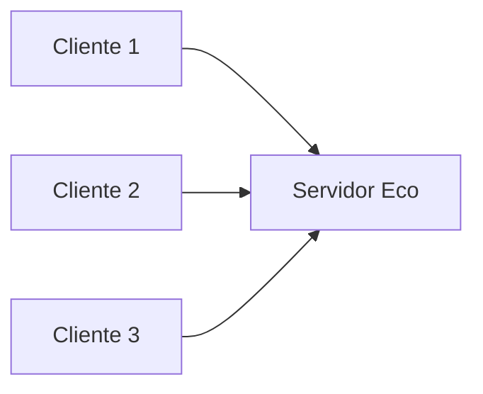
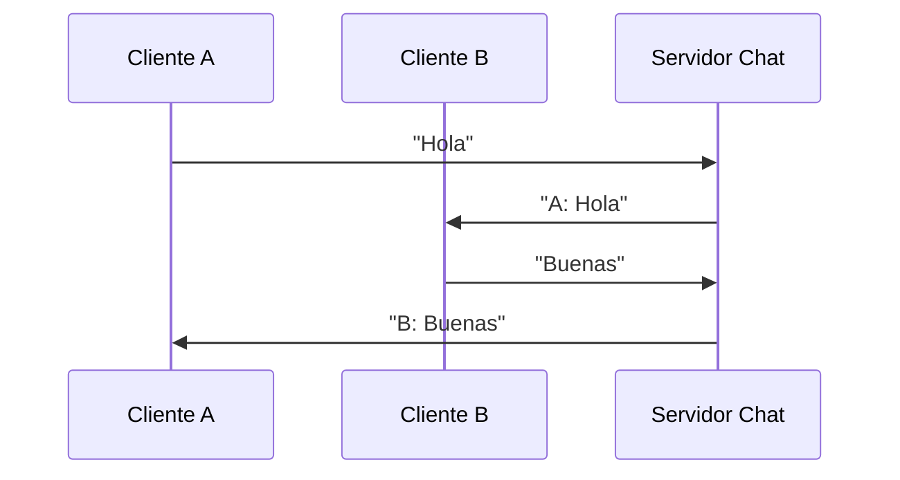
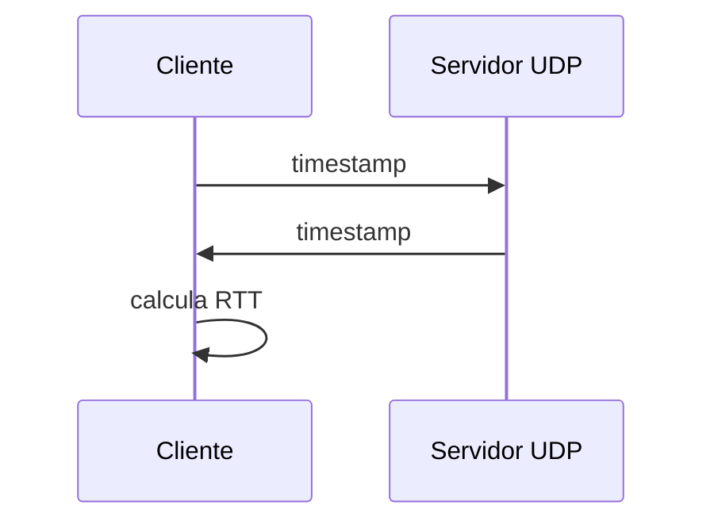
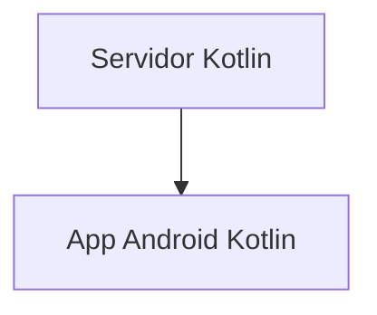

# MINIPROYECTO 1

# Servidor Eco Concurrente con Corrutinas

Dificultad: Básica–Intermedia
Duración: 45–60 minutos

## 1. Objetivo

Crear un servidor que:

1. Acepte múltiples clientes simultáneos
2. Lea líneas enviadas por cada cliente
3. Devuelva (“eco”) cada línea recibida
4. Use **corrutinas**, no threads

Este ejercicio enseña:

- Entrada/salida con buffers Kotlin
- Manejo correcto de streams
- Corrutinas con `Dispatchers.IO`
- Control básico de errores en clientes desconectados

---

## 2. Diagrama



---

## 3. Código del Servidor

```kotlin
import kotlinx.coroutines.*
import java.net.ServerSocket
import java.net.Socket

fun main() = runBlocking {
    val server = ServerSocket(9000)
    println("Servidor ECO disponible en puerto 9000")

    while (true) {
        val client = server.accept()
        println("Cliente conectado: ${client.inetAddress.hostAddress}")

        launch(Dispatchers.IO) {
            procesarCliente(client)
        }
    }
}

suspend fun procesarCliente(socket: Socket) {
    try {
        val input = socket.getInputStream().bufferedReader()
        val output = socket.getOutputStream().bufferedWriter()

        var linea: String?

        while (true) {
            linea = input.readLine() ?: break
            println("Recibido: $linea")

            output.write("Eco: $linea\n")
            output.flush()
        }
    } finally {
        println("Cliente desconectado")
        socket.close()
    }
}
```

---

## 4. Código del Cliente (consola)

```kotlin
import java.net.Socket

fun main() {
    val socket = Socket("127.0.0.1", 9000)
    val input = socket.getInputStream().bufferedReader()
    val output = socket.getOutputStream().bufferedWriter()

    println("Conectado. Escribe mensajes:")

    while (true) {
        val mensaje = readln()
        output.write("$mensaje\n")
        output.flush()

        val respuesta = input.readLine()
        println("Servidor: $respuesta")
    }
}
```

---

# MINIPROYECTO 2

# Chat Multiusuario con Broadcast

Dificultad: Intermedia
Duración: 1h 30m – 2h

## 1. Objetivo

Crear un chat de consola donde:

1. El servidor mantiene una lista de clientes conectados
2. Cada vez que un cliente envía un mensaje, el servidor lo **broadcast** a todos
3. Se gestionan conexiones y desconexiones
4. Toda la concurrencia se maneja con corrutinas

---

## 2. Consideraciones Profesionales

- Una lista de clientes debe ser **thread-safe**.
  Se recomienda `Collections.synchronizedList()`.
- Cada cliente tiene su propia corrutina.
- El servidor debe eliminar clientes desconectados.

---

## 3. Diagrama de Interacción



---

## 4. Código del Servidor

```kotlin
import kotlinx.coroutines.*
import java.net.ServerSocket
import java.net.Socket
import java.util.Collections

data class Cliente(val socket: Socket, val nombre: String)

val clientes = Collections.synchronizedList(mutableListOf<Cliente>())

fun main() = runBlocking {
    val server = ServerSocket(9001)
    println("Servidor de Chat en puerto 9001")

    while (true) {
        val socket = server.accept()

        launch(Dispatchers.IO) {
            registrarCliente(socket)
        }
    }
}

suspend fun registrarCliente(socket: Socket) {
    val input = socket.getInputStream().bufferedReader()
    val output = socket.getOutputStream().bufferedWriter()

    output.write("Introduce tu nombre:\n")
    output.flush()
    val nombre = input.readLine() ?: return

    val cliente = Cliente(socket, nombre)
    clientes.add(cliente)

    broadcast("$nombre se ha unido al chat")

    try {
        var mensaje: String?

        while (true) {
            mensaje = input.readLine() ?: break
            broadcast("$nombre: $mensaje")
        }
    } finally {
        clientes.remove(cliente)
        broadcast("$nombre ha salido del chat")
        socket.close()
    }
}

fun broadcast(mensaje: String) {
    synchronized(clientes) {
        for (cliente in clientes) {
            val out = cliente.socket.getOutputStream().bufferedWriter()
            out.write("$mensaje\n")
            out.flush()
        }
    }
}
```

---

## 5. Código del Cliente

```kotlin
import java.net.Socket
import kotlin.concurrent.thread

fun main() {
    val socket = Socket("127.0.0.1", 9001)
    val input = socket.getInputStream().bufferedReader()
    val output = socket.getOutputStream().bufferedWriter()

    thread {
        while (true) {
            val msg = input.readLine() ?: break
            println(msg)
        }
    }

    while (true) {
        val linea = readln()
        output.write("$linea\n")
        output.flush()
    }
}
```

---

# MINIPROYECTO 3

# Monitor de Latencia UDP (mini-Ping)

Dificultad: Intermedia
Duración: 45–60 min

## 1. Objetivo

Crear una herramienta que mida la latencia real mediante UDP:

1. Cliente envía un timestamp
2. Servidor responde repitiendo el mismo timestamp
3. Cliente calcula Round Trip Time (RTT)
4. Se muestran tiempos medios y desviación básica

---

## 2. Diagrama



---

## 3. Código del Servidor

```kotlin
import java.net.DatagramPacket
import java.net.DatagramSocket

fun main() {
    val socket = DatagramSocket(5001)
    val buffer = ByteArray(1024)

    println("Servidor UDP de latencia en puerto 5001")

    while (true) {
        val packet = DatagramPacket(buffer, buffer.size)
        socket.receive(packet)

        val recibido = packet.data.decodeToString(0, packet.length)

        val respuesta = recibido.encodeToByteArray()
        val replyPacket = DatagramPacket(
            respuesta,
            respuesta.size,
            packet.address,
            packet.port
        )

        socket.send(replyPacket)
    }
}
```

---

## 4. Código del Cliente

```kotlin
import java.net.DatagramPacket
import java.net.DatagramSocket
import java.net.InetAddress
import kotlin.math.roundToInt

fun main() {
    val socket = DatagramSocket()
    val serverIp = InetAddress.getByName("127.0.0.1")
    val puerto = 5001

    repeat(10) {
        val t1 = System.nanoTime()
        val data = t1.toString().encodeToByteArray()

        val paquete = DatagramPacket(data, data.size, serverIp, puerto)
        socket.send(paquete)

        val buffer = ByteArray(1024)
        val respuesta = DatagramPacket(buffer, buffer.size)
        socket.receive(respuesta)

        val t2 = System.nanoTime()
        val rtt = (t2 - t1) / 1_000_000.0

        println("RTT: ${rtt.roundToInt()} ms")
    }

    socket.close()
}
```

---

# MINIPROYECTO 4

# Servidor para Cliente Android (Base Real para Jetpack Compose)

Dificultad: Intermedia–Alta
Duración: 2h

## 1. Objetivo

Construir un servidor Kotlin que:

- Envíe datos periódicamente (por ejemplo, temperatura simulada)
- Acepte peticiones de un cliente Android
- Use corrutinas
- Use un formato **muy simple** para centrarse en sockets, no en JSON

Esto prepara la futura práctica de Android.

---

## 2. Diagrama



---

## 3. Servidor (Simulación de sensor)

```kotlin
import kotlinx.coroutines.*
import java.net.ServerSocket
import kotlin.random.Random

fun main() = runBlocking {
    val server = ServerSocket(9002)
    println("Servidor de datos en puerto 9002")

    while (true) {
        val client = server.accept()
        launch(Dispatchers.IO) { manejarCliente(client) }
    }
}

suspend fun manejarCliente(socket: java.net.Socket) {
    val out = socket.getOutputStream().bufferedWriter()

    while (true) {
        val valor = Random.nextDouble(20.0, 35.0)
        out.write("TEMP:$valor\n")
        out.flush()
        delay(2000)
    }
}
```

---

## 4. Cliente Android (Kotlin) – Lógica de Red

Esta es la lógica de red que luego se integrará en un `ViewModel` de Jetpack Compose:

```kotlin
suspend fun recibirDatos(): Flow<Double> = flow {
    val socket = Socket("192.168.1.100", 9002)
    val input = socket.getInputStream().bufferedReader()

    while (true) {
        val linea = input.readLine() ?: break
        if (linea.startsWith("TEMP:")) {
            val valor = linea.removePrefix("TEMP:").toDouble()
            emit(valor)
        }
    }

    socket.close()
}.flowOn(Dispatchers.IO)
```

---
