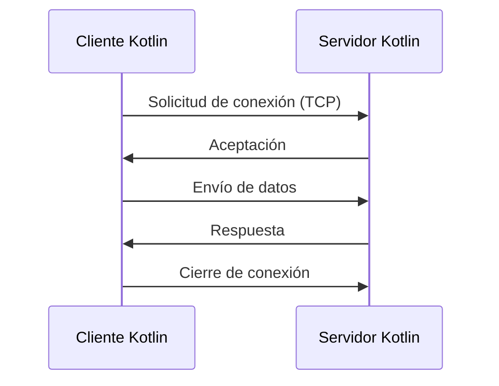

# UT3. Programación de Comunicaciones en Red con Sockets en Kotlin

---

# 1. Introducción a la Comunicación en Red y Sockets

## 1.1. Qué es la comunicación en red

La comunicación en red implica que dos procesos —cliente y servidor— intercambian datos a través de un canal lógico llamado **socket**.
En Kotlin, el soporte de sockets es accesible desde la librería estándar de la JVM, pero se utiliza **con sintaxis, estructuras, objetos y corrutinas Kotlin**.

---

## 1.2. Escenarios típicos

- Chats y mensajería instantánea
- Juegos multijugador
- Sensores e IoT
- Comunicación entre dos Android (LAN, WiFi Direct, hotspot)
- Sincronización de datos
- Evitar dependencias HTTP cuando se necesita velocidad o persistencia de conexiones

---

## 1.3. Cliente y Servidor

**Servidor:**

- Abre un puerto
- Espera conexiones
- Atiende a uno o varios clientes
- Mantiene lógica de negocio

**Cliente:**

- Se conecta al servidor
- Envía datos
- Recibe respuestas

---

## 1.4. Qué es un socket

Un socket es un objeto bidireccional que permite enviar y recibir bytes.
Se compone de:

- Dirección IP
- Puerto
- Canal de entrada (InputStream)
- Canal de salida (OutputStream)

---

## 1.5. Tipos

| Tipo    | Características                                                                                            |
| ------- | ---------------------------------------------------------------------------------------------------------- |
| **TCP** | Orientado a conexión. Garantiza entrega y orden. Útil para chat, transacciones, juegos con lógica estable. |
| **UDP** | No orientado a conexión. Rápido. Adecuado para streaming, telemetría, juegos a alta velocidad.             |

---

# 2. Programación Cliente-Servidor con Sockets (Kotlin puro)

Toda esta sección está escrita **solo con Kotlin**.
Nada de Java.
Las clases del JDK se acceden con sintaxis Kotlin, métodos Kotlin y wrappers Kotlin.

---

# 2.1. Diagrama general



---

# 2.2. Servidor TCP básico (Kotlin idiomático)

```kotlin
import java.net.ServerSocket

fun main() {
    val server = ServerSocket(9000)
    println("Servidor iniciado en puerto 9000")

    while (true) {
        val client = server.accept()
        println("Nuevo cliente conectado: ${client.inetAddress.hostAddress}")

        val input = client.getInputStream().bufferedReader()
        val output = client.getOutputStream().bufferedWriter()

        val recibido = input.readLine()
        println("Cliente envió: $recibido")

        output.write("Eco: $recibido\n")
        output.flush()

        client.close()
    }
}
```

Características Kotlin:

- Uso de `bufferedReader()` y `bufferedWriter()` directamente desde Kotlin
- Interpolación de strings (`${...}`)
- Flujos con `readLine()` y `write()`

---

# 2.3. Cliente TCP (Kotlin puro)

```kotlin
import java.net.Socket

fun main() {
    val socket = Socket("127.0.0.1", 9000)

    val input = socket.getInputStream().bufferedReader()
    val output = socket.getOutputStream().bufferedWriter()

    output.write("Hola servidor desde Kotlin\n")
    output.flush()

    val respuesta = input.readLine()
    println("Respuesta del servidor: $respuesta")

    socket.close()
}
```

---

# 2.4. Concurrencia moderna con corrutinas (Kotlin 2025)

La forma profesional de hacer un servidor con múltiples clientes en Kotlin no es con threads, sino **con corrutinas**.

```kotlin
import kotlinx.coroutines.*
import java.net.ServerSocket

fun main() = runBlocking {
    val server = ServerSocket(9000)
    println("Servidor concurrente con corrutinas")

    while (true) {
        val client = server.accept()

        launch(Dispatchers.IO) {
            val input = client.getInputStream().bufferedReader()
            val output = client.getOutputStream().bufferedWriter()

            val msg = input.readLine()
            println("(${currentCoroutineContext()}) Cliente: $msg")

            output.write("Procesado: $msg\n")
            output.flush()

            client.close()
        }
    }
}
```

Ventajas:

- No se bloquea el hilo principal
- Cada cliente se maneja en una corrutina
- Rendimiento muy alto
- Solución idiomática Kotlin

---

# 3. Sockets UDP con Kotlin

UDP se maneja con objetos `DatagramSocket` y `DatagramPacket`.

---

# 3.1. Servidor UDP con Kotlin

```kotlin
import java.net.DatagramPacket
import java.net.DatagramSocket

fun main() {
    val socket = DatagramSocket(5000)
    val buffer = ByteArray(1024)

    println("Servidor UDP escuchando en puerto 5000")

    while (true) {
        val packet = DatagramPacket(buffer, buffer.size)
        socket.receive(packet)

        val texto = packet.data.decodeToString(0, packet.length)
        println("Recibido: $texto")
    }
}
```

---

# 3.2. Cliente UDP con Kotlin

```kotlin
import java.net.DatagramPacket
import java.net.DatagramSocket
import java.net.InetAddress

fun main() {
    val socket = DatagramSocket()
    val mensaje = "Hola UDP Kotlin".encodeToByteArray()

    val packet = DatagramPacket(
        mensaje,
        mensaje.size,
        InetAddress.getByName("127.0.0.1"),
        5000
    )

    socket.send(packet)
    socket.close()
}
```

---

# 4. Estructuras concurrentes en Kotlin

## 4.1. Estrategias

| Estrategia         | Recomendación en Kotlin      |
| ------------------ | ---------------------------- |
| Thread por cliente | Desaconsejado                |
| Pool de threads    | Válido en sistemas heredados |
| Corrutinas         | La opción moderna en Kotlin  |

---

## 4.2. Implementación profesional con corrutinas y SupervisorJob

```kotlin
val scope = CoroutineScope(SupervisorJob() + Dispatchers.IO)

while (true) {
    val cliente = server.accept()

    scope.launch {
        procesarCliente(cliente)
    }
}
```

---

# 5. Monitorización y Depuración en Kotlin

Aunque las herramientas son externas, el enfoque es 100 % aplicable a proyectos Kotlin.

## 5.1. Herramientas

- Wireshark: inspección de paquetes
- netstat o ss: ver puertos abiertos
- tcpdump: análisis en terminal
- Logs estructurados con Kotlin Logging

---

## 5.2. Problemas típicos

| Problema               | Explicación                                 |
| ---------------------- | ------------------------------------------- |
| Bloqueo                | La lectura `readLine()` no finaliza         |
| Pérdida de mensajes    | UDP sin garantías                           |
| Desconexión inesperada | El cliente cierra antes de enviar           |
| Sin flush              | El servidor no envía porque falta `flush()` |

---

# 6. Miniproyectos 100 % Kotlin

Pensados para FP, reutilizables en Android Jetpack Compose.

---

## Miniproyecto 1: Eco concurrente con corrutinas

Servidor que recibe un mensaje y devuelve el mismo.

Objetivos:

- Corrutinas
- Conversión de bytes a texto
- Lógica paralela

---

## Miniproyecto 2: Chat simple con broadcast

Servidor que:

1. Mantiene una lista mutable de clientes
2. Cada mensaje que recibe lo reenvía a todos

Conceptos Kotlin:

- Listas sincronizadas
- Corrutinas para cada cliente
- Eliminación de clientes desconectados

---

## Miniproyecto 3: Monitor de latencia UDP

- Cliente envía timestamp
- Servidor devuelve el mismo timestamp
- Cliente calcula RTT

Uso de:

- `System.nanoTime()`
- `decodeToString()`
- `encodeToByteArray()`

---

## Miniproyecto 4: Servidor para apps Android

Pensado para integrarlo luego en Jetpack Compose.

- Servidor TCP en Kotlin
- Cliente Android en otra práctica
- Comunicación binaria o textual
- Corrutinas IO para llamadas de red

---
